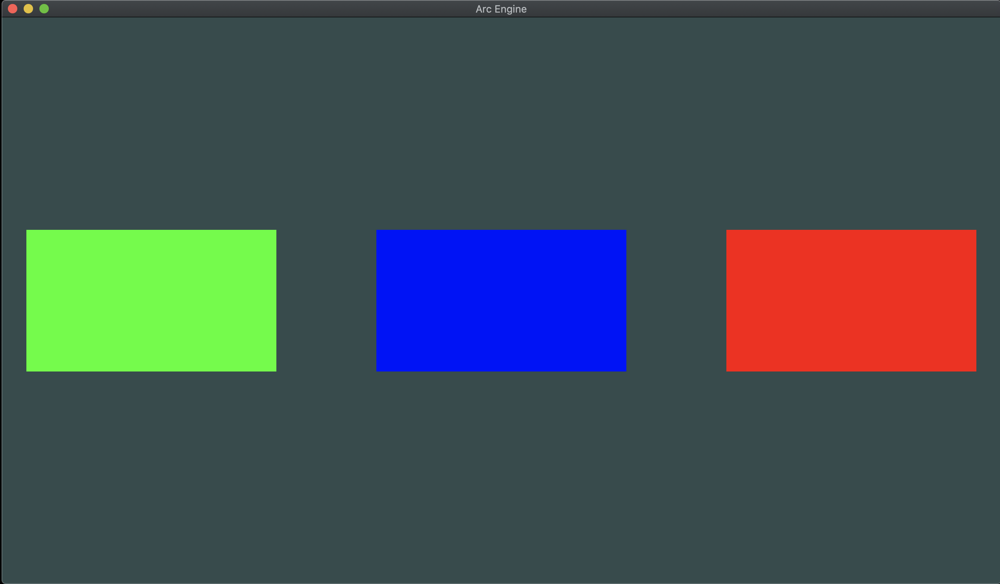

# 2D Batch Renderer
A Batch Renderer built in c++, to practice cross-platform development, and to learn the different graphics API's available on different systems

## Examples
| Windows (OpenGL)  | MacOSX (Metal) |
|--                 |             ---|
| | |


## Supported Platforms
- Current Supported
    - Windows (OpenGL)
    - MacOSX (Metal)
- Future Support
    - Linux (Vulkan)
    - iOS (Metal)
    - Android (OpenGL ES)
    - Windows (DirectX 12)

## Current Features:
- 2D Batch Renderer
    - Capable of drawing colored quads of varying sizes and rotations
    - Supports upto 100 Quads
- ECS System
    - Rudamentary ECS System implemented using entt
    - Allows for the addition of a Transform and SpriteRenderer Component
- Scene System
    - Allows a Scene to Contain Multiple Entities
    - Entities Are Saved and Altered in a Json File
    - Multiple Scenes Can Be Created
    
## Building Project
- Windows
```
git clone https://github.com/tomheeleynz/2D-Batch-Renderer.git
cd 2D-Batch-Renderer
run GenerateProjects.bat
```
- MacOS
```
git clone https://github.com/tomheeleynz/2D-Batch-Renderer.git
cd 2D-Batch-Renderer
run command cmake -G Xcode .
In build settings in Xcode of the ArcEngine Library, set bridging header to ArcEngine/src/Platform/MacOSX/Metal/ArcEngine-Bridging-Header.h 
```
